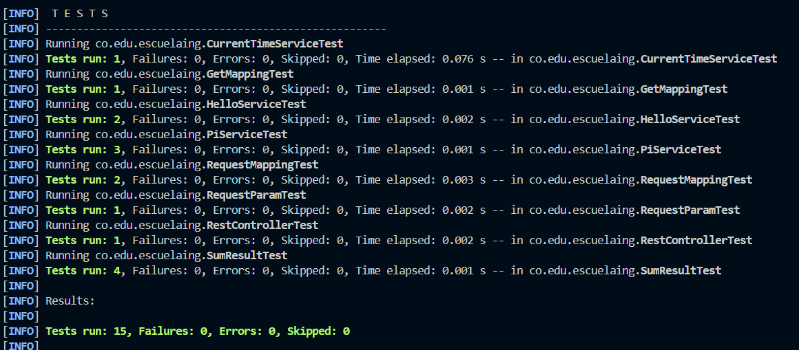
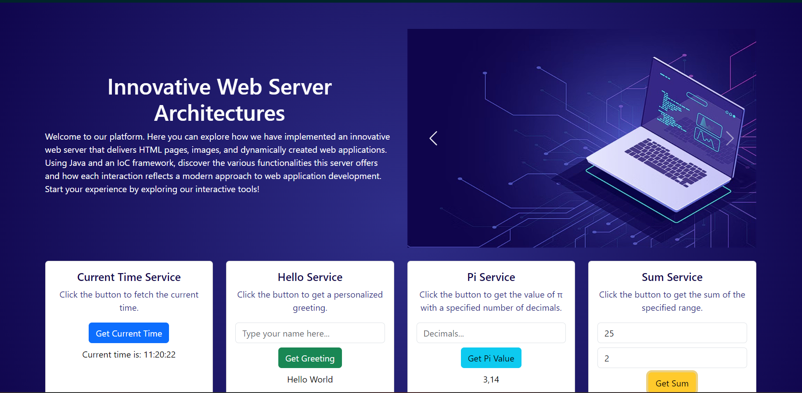

# Advanced Java Server Architectures

Advanced Java Server Architectures is a Java-based project focused on implementing a flexible web server that handles HTTP GET and POST requests, serves static files, and supports asynchronous communication with REST services. This project demonstrates a custom web server architecture and includes components for handling HTTP requests and responses.

## Key Features

- **GET and POST Request Handling**: Manages HTTP GET requests for static file serving and POST requests for data processing.
- **Static File Serving**: Delivers HTML, CSS, JavaScript, and image files from designated directories.
- **Asynchronous REST Communication**: Executes asynchronous GET requests to external REST services and processes responses efficiently.

## Project Structure

## Main Classes

1. **GetMapping.java**:
   - **Purpose**: Defines the `@GetMapping` annotation.
   - **Description**: This annotation is used to map HTTP GET requests to specific methods in a controller class. It allows methods to handle GET requests for a particular URL pattern, facilitating the retrieval of data from the server.

2. **RequestMapping.java**:
   - **Purpose**: Defines the `@RequestMapping` annotation.
   - **Description**: This annotation maps HTTP requests to specific classes or methods based on the URL pattern. It can be used at both the class and method levels to specify the request paths that should be handled. It supports multiple request methods (GET, POST, etc.) and is crucial for routing requests correctly.

3. **RequestParam.java**:
   - **Purpose**: Defines the `@RequestParam` annotation.
   - **Description**: This annotation binds web request parameters to method parameters in controller classes. It allows you to extract parameters from the request and use them in your methods, with support for default values if parameters are not provided.

4. **RestController.java**:
   - **Purpose**: Defines the `@RestController` annotation.
   - **Description**: This annotation marks a class as a REST controller, which means it handles HTTP requests and returns data in response. It combines `@Controller` and `@ResponseBody`, indicating that methods in the class return response bodies directly rather than views.

### Service Classes

5. **CurrentTimeService.java**:
   - **Purpose**: Provides current time data.
   - **Description**: This service returns the current system time. It is used to demonstrate how services can be used to provide dynamic data to clients. The service is integrated with the web server to respond to requests for the current time.

6. **HelloService.java**:
   - **Purpose**: Provides greeting messages.
   - **Description**: This service returns a simple greeting message, such as "Hello, World!". It serves as a basic example of how services can be used to deliver static text responses.

7. **PiService.java**:
   - **Purpose**: Provides the value of Pi.
   - **Description**: This service returns the value of Pi to a specified precision. It demonstrates how to perform calculations and format results in response to client requests. The service can handle different precision levels as specified by the client.

8. **SumResult.java**:
   - **Purpose**: Calculates the sum of two numbers.
   - **Description**: This class provides functionality to compute the sum of two integers. It handles edge cases, such as when the integers are equal or when default values are used. It demonstrates how to process request parameters and return computed results.

### Web Server Class

9. **SimpleWebServer.java**:
   - **Purpose**: Main class to initialize and run the web server.
   - **Description**: This is the entry point of the application that sets up and starts the web server. It initializes a thread pool to handle multiple concurrent connections and listens for incoming requests on a specified port. It delegates request handling to `ClientHandler` and integrates with the rest of the server components.

## Unit Tests

The project includes comprehensive unit tests to ensure the correct functionality of various components. Below is a description of each test class:

### Unit Test Files

1. **CurrentTimeServiceTest.java**:
   - **Purpose**: Tests the functionality of the `CurrentTimeService` class.
   - **Description**: Verifies that the service correctly returns the current system time and handles edge cases (e.g., time format). Ensures that the service operates as expected when integrated with the web server.

2. **GetMappingTest.java**:
   - **Purpose**: Tests the behavior of methods annotated with `@GetMapping`.
   - **Description**: Ensures that methods mapped to HTTP GET requests correctly handle various scenarios, including path variables and query parameters. Confirms that the server routes requests to the correct method and responds with the appropriate data.

3. **HelloServiceTest.java**:
   - **Purpose**: Tests the `HelloService` class.
   - **Description**: Validates that the service provides the expected "Hello, World!" message or similar greetings. This test is crucial for verifying that basic service functionality is correctly implemented and integrated.

4. **PiServiceTest.java**:
   - **Purpose**: Tests the `PiService` class.
   - **Description**: Checks the service's ability to return the value of Pi to a specified precision. Ensures accuracy in the computation and formatting of Pi values and validates the service's response to different precision requests.

5. **RequestMappingTest.java**:
   - **Purpose**: Tests the behavior of the `@RequestMapping` annotation.
   - **Description**: Verifies that methods annotated with `@RequestMapping` are correctly mapped to specified URL patterns. Ensures that the server routes requests according to the provided paths and handles various request methods (GET, POST) as expected.

6. **RequestParamTest.java**:
   - **Purpose**: Tests the behavior of the `@RequestParam` annotation.
   - **Description**: Confirms that method parameters annotated with `@RequestParam` are correctly bound to request parameters. Validates default values and proper handling of missing or malformed parameters. Ensures that the parameters are correctly parsed and used in request handling.

7. **RestControllerTest.java**:
   - **Purpose**: Tests the `@RestController` annotation.
   - **Description**: Ensures that classes annotated with `@RestController` correctly handle HTTP requests and provide responses in the expected format. Verifies that the controller methods return the correct data and interact properly with other components.

8. **SumResultTest.java**:
   - **Purpose**: Tests the `SumResult` class.
   - **Description**: Validates that the `SumResult` class calculates and returns the sum of two numbers as expected. Checks edge cases, such as when the numbers are equal or when one or both are missing. Ensures the correct handling of default values and parameter swapping logic.

### Running Unit Tests

To execute the unit tests, ensure that JUnit and Mockito are set up in your project. Use the following commands to compile and run the tests:

1. **Compile the Tests**:

   ```bash
   mvn clean install
   ```

2. **Run the Tests**:

   ```bash
   mvn test
   ```



## Architecture

1. **User Interaction**:
   - Users make HTTP requests to the server, which processes and responds based on the request type (GET or POST).

2. **Request Handling**:
   - The server employs a thread pool to handle multiple simultaneous connections.
   - GET requests serve static content or data from REST services.
   - POST requests process and display client-submitted data.

3. **Asynchronous Communication**:
   - `RestClient` manages asynchronous GET requests to external services and handles responses.

   

## Installation and Execution

### Prerequisites

- Java Development Kit (JDK) 17 or higher

### Installation Steps

1. **Clone the Repository**:

   ```bash
   git clone https://github.com/JohannBulls/Advanced-Java-Server-Architectures.git
   cd Advanced-Java-Server-Architectures
   ```

2. **Compile the Project**:

   ```bash
   mvn clean install
   ```

3. **Run the Server**:

   ```bash
   mvn exec:java
   ```

4. **Access the Application**:
   - Open a web browser and navigate to `http://localhost:8080`.
   - Interact with static files, perform POST requests, and view the data received.

   


### Running Unit Tests

To execute unit tests, ensure JUnit and Mockito are configured in your project. Then, run the following commands:

1. **Compile the Tests**:

   ```bash
   mvn clean install
   ```

2. **Run the Tests**:

   ```bash
   mvn test
   ```

## Technologies Used

- **Java**: Main programming language.
- **HttpClient**: For asynchronous REST communication.
- **ExecutorService**: For managing concurrent requests.
- **JUnit**: For unit testing.
- **Mockito**: For mocking dependencies in unit tests.

## Author

- Johann Amaya Lopez - *JohannBulls* - [GitHub](https://github.com/JohannBulls)

## License

This project is licensed under the MIT License. See the [LICENSE](LICENSE.txt) file for details.
